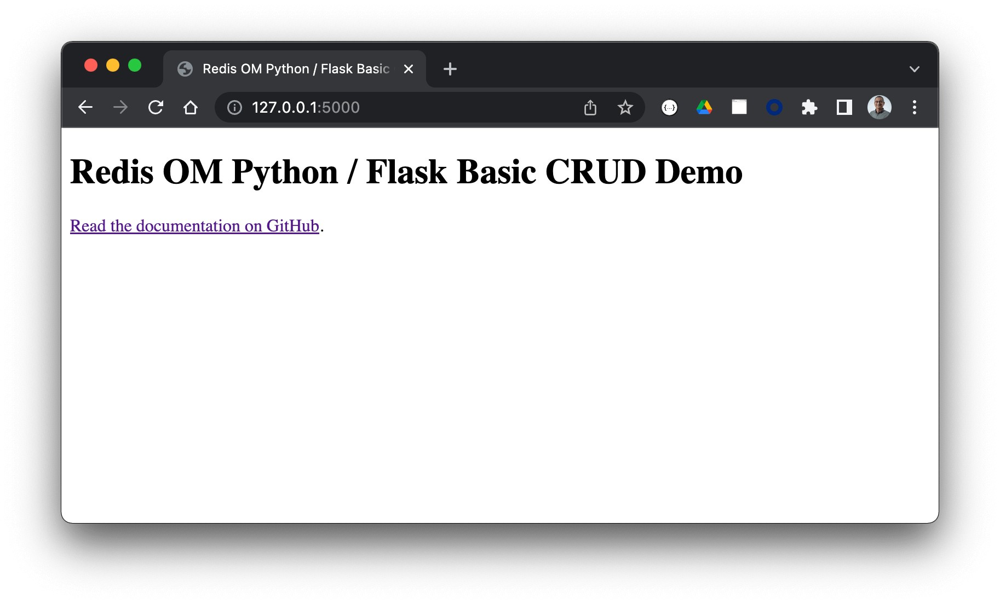

# Redis OM Python Flask Starter Application

A starter application for performing CRUD type operations with Redis OM Python ([GitHub](https://github.com/redis/redis-om-python), [Blog Post](https://redis.com/blog/introducing-redis-om-for-python/)) and the [Flask](https://flask.palletsprojects.com/) microframework.

We'd love to see what you build with Redis, RediSearch and Redis OM.  [Join the Redis community on Discord](https://discord.gg/redis) to chat with us about all things Redis OM and Redis.

## Overview

This application demonstrates common data manipulation patterns using Redis OM, an API built with Flask and a simple domain model.

Our entity is a Person, with the following JSON representation:

```json
{
  "first_name": "A string, the person's first or given name",
  "last_name": "A string, the person's last or surname",
  "age": 36,
  "address": {
    "street_number": 56,
    "unit": "A string, optional unit number e.g. A or 1",
    "street_name": "A string, name of the street they live on",
    "city": "A string, name of the city they live in",
    "state": "A string, state, province or county that they live in",
    "postal_code": "A string, their zip or postal code",
    "country": "A string, country that they live in."
},
  "personal_statement": "A string, free text personal statement",
  "skills": [
    "A string: a skill the person has",
    "A string: another still that the person has"
  ]
}
```

We'll let Redis OM handle generation of unique IDs, which it does using [ULIDs](https://github.com/ulid/spec).  Redis OM will also handle creation of unique Redis key names for us, as well as saving and retrieving entities from JSON documents stored in Redis.

## Getting Started

Let's go...

### Requirements

To run this application you'll need:

* [git](https://git-scm.com/download) - to clone the repo to your machine. 
* [Python 3.9 or higher](https://www.python.org/downloads/).
* A [Redis](https://redis.io) database with the [RediSearch](https://redisearch.io) module version TODO or higher installed.  We've provided a `docker-compose.yml` for this.  You can also [sign up for a free 30Mb database with Redis Enterprise Cloud](https://redis.com/try-free/) - be sure to check the box to install RediSearch when creating your cloud database, follow [this guide](https://developer.redis.com/create/rediscloud/).
* [curl](https://curl.se/), or [Postman](https://www.postman.com/) - to send HTTP requests to the application.  We'll provide examples using curl in this document.
* Optional: [RedisInsight](https://redis.com/redis-enterprise/redis-insight/), a free data visualization and database management tool for Redis.  When downloading RedisInsight, be sure to select version 2.x.

### Get the Source Code

Clone the repository from GitHub:

```bash
$ git clone https://github.com/redis-developer/redis-om-python-flask-skeleton-app.git
$ cd redis-om-python-flask-skeleton-app
```

### Start a Redis Server, or Configure your Redis Enterprise Cloud Credentials

Next, we'll get a Redis Server up and running.  If you're using Docker:

```bash
$ docker-compose up -d
Creating network "redis-om-python-flask-skeleton-app_default" with the default driver
Creating redis_om_python_flask_starter ... done
$ 
```

If you're using Redis Enterprise Cloud, you'll need the hostname, port number, and password for your database.  Use these to set the `REDIS_OM_URL` environment variable like this:

```bash
$ export REDIS_OM_URL=redis://:<password>@<host>:<port>
```

(This step is not required when working with Docker as the Docker container runs Redis on `localhost` port `6379` with no password, which is the default connection that Redis OM uses.)

For example if your Redis Enterprise Cloud database is at port `9139` on host `enterprise.redis.com` and your password is `5uper53cret` then you'd set `REDIS_OM_URL` as follows:

```bash
$ export REDIS_OM_URL=redis://:5uper53cret@enterprise.redis.com:9139
```

Note the `:` before the password.

### Create a Python Virtual Environment and Install the Dependencies

Create a Python virtual environment, and install the project dependencies which are [Flask](https://pypi.org/project/Flask/), [Requests](https://pypi.org/project/requests/) (used only in the data loader script) and [Redis OM](https://pypi.org/project/redis-om/):

```bash
$ python3 -m venv venv
$ . ./venv/bin/activate
$ pip install -r requirements.txt
```

### Start the Flask Application

Let's start the Flask application in development mode, so that Flask will restart the server for you each time you save code changes in `app.py`:

```bash
$ export FLASK_ENV=development
$ flask run

If all goes well, you should see output similar to this:

```bash
$ flask run
 * Environment: development
 * Debug mode: on
 * Running on http://127.0.0.1:5000/ (Press CTRL+C to quit)
 * Restarting with stat
 * Debugger is active!
 * Debugger PIN: XXX-XXX-XXX
```

You're now up and running, and ready to perform CRUD operations on data with Redis, RediSearch, RedisJSON and Redis OM for Python!  To make sure the server's running, point your browser at `http://127.0.0.1:5000/`, where you can expect to see the application's basic home page:



### Load the Sample Data

We've provided a small amount of sample data (it's in `data/people.json`.  The Python script `dataloader.py` loads each person into Redis by posting the data to the application's create a new person endpoint.  Run it like this:

```bash
$ python dataloader.py
Created person Robert McDonald with ID 01FX8RMR7NRS45PBT3XP9KNAZH
Created person Kareem Khan with ID 01FX8RMR7T60ANQTS4P9NKPKX8
Created person Fernando Ortega with ID 01FX8RMR7YB283BPZ88HAG066P
Created person Noor Vasan with ID 01FX8RMR82D091TC37B45RCWY3
Created person Dan Harris with ID 01FX8RMR8545RWW4DYCE5MSZA1
```

Make sure to take a copy of the output of the data loader, as your IDs will differ from those used in the tutorial.  To follow along, substitute your IDs for the ones shown above.  e.g. whenever we are working with Kareem Khan, change 01FX8RMR7T60ANQTS4P9NKPKX8 for the ID that your data loader assiged to Kareem in your Redis database.

### Problems?

If the Flask server fails to start, take a look at its output.  If you see log entries similar to this:

```python
raise ConnectionError(self._error_message(e))
redis.exceptions.ConnectionError: Error 61 connecting to localhost:6379. Connection refused.
```

then you need to start the Redis Docker container if using Docker, or set the `REDIS_OM_URL` environment variable if using Redis Enterprise Cloud.

If you've set the `REDIS_OM_URL` environment variable, and the code errors with something like this on startup:

```python
raise ConnectionError(self._error_message(e))
redis.exceptions.ConnectionError: Error 8 connecting to enterprise.redis.com:9139. nodename nor servname provided, or not known.
```

then you'll need to check that you used the correct hostname, port, password and format when setting `REDIS_OM_URL`.

If the data loader fails to post the sample data into the application, make sure that the Flask application is running **before** running the data loader.

## Create, Read, Update and Delete Data

Let's create and manipulate some instances of our data model in Redis.  Here we'll look at how to call the Flask API with curl (you could also use Postman), how the code works, and how the data's stored in Redis.

### Building a Person Model with Redis OM

TODO

### Adding New People

TODO code description

With the server running, add a new person using curl:

```bash
$ curl --location --request POST 'http://127.0.0.1:5000/person/new' \
--header 'Content-Type: application/json' \
--data-raw '{
    "first_name": "Joanne",
    "last_name": "Peel",
    "age": 36,
    "personal_statement": "Music is my life, I love gigging and playing with my band.",
    "address": {
      "street_number": 56,
      "street_name": "The Rushes",
      "city": "Birmingham",
      "state": "West Midlands",
      "postal_code": "B91 6HG",
      "country": "United Kingdom"
    },
    "skills": [
      "synths",
      "vocals",
      "guitar"
    ]
}'
```

Running the above curl command will return the unique ULID ID assigned to the newly created person. For example `01FX8SSSDN7PT9T3N0JZZA758G`.

### Find a Person by ID

If we know a person's ID, we can retrieve their data.

TODO code description

Try this out with curl, substituting `01FX8SSSDN7PT9T3N0JZZA758G` for the ID of a person that you just created in your database:

```bash
$ curl --location --request GET 'http://localhost:5000/person/byid/01FX8SSSDN7PT9T3N0JZZA758G'
```

The server responds with a JSON object containing the user's data:

```json
{
  "address": {
    "city": "Birmingham",
    "country": "United Kingdom",
    "pk": "01FX8SSSDNRDSRB3HMVH00NQTT",
    "postal_code": "B91 6HG",
    "state": "West Midlands",
    "street_name": "The Rushes",
    "street_number": 56,
    "unit": null
  },
  "age": 36,
  "first_name": "Joanne",
  "last_name": "Peel",
  "personal_statement": "Music is my life, I love gigging and playing with my band.",
  "pk": "01FX8SSSDN7PT9T3N0JZZA758G",
  "skills": [
    "synths",
    "vocals",
    "guitar"
  ]
}
```

### Find People with Matching First and Last Name

Let's find all the people who have a given first and last name...

TODO code description.

Try this out with curl as follows:

```bash
$ curl --location --request GET 'http://127.0.0.1:5000/people/byname/Kareem/Khan'
```

**Note:** First and last name are case sensitive.

The server responds with an object containing `results`, an array of matches:

```json
{
  "results": [
    {
      "address": {
        "city": "Sheffield",
        "country": "United Kingdom",
        "pk": "01FX8RMR7THMGA84RH8ZRQRRP9", 
        "postal_code": "S1 5RE",
        "state": "South Yorkshire",
        "street_name": "The Beltway",
        "street_number": 1,
        "unit": "A"
      },
      "age": 27,
      "first_name": "Kareem",
      "last_name": "Khan",
      "personal_statement":"I'm Kareem, a multi-instrumentalist and singer looking to join a new rock band.",
      "pk":"01FX8RMR7T60ANQTS4P9NKPKX8",
      "skills": [
        "drums",
        "guitar",
        "synths"
      ]
    }
  ]
}
```

### Find People within a Given Age Range

TODO

Let's find everyone between 30 and 47 years old, sorted by age:

```bash
$ curl --location --request GET 'http://127.0.0.1:5000/people/byage/30/47'

```

This returns a `results` object containing an array of matches:

```json
{
  "results": [
    {
      "address": {
        "city": "Sheffield",
        "country": "United Kingdom",
        "pk": "01FX8RMR7NW221STN6NVRDPEDT",
        "postal_code": "S12 2MX",
        "state": "South Yorkshire",
        "street_name": "Main Street",
        "street_number": 9,
        "unit": null
      },
      "age": 35,
      "first_name": "Robert",
      "last_name": "McDonald",
      "personal_statement": "My name is Robert, I love meeting new people and enjoy music, coding and walking my dog.",
      "pk": "01FX8RMR7NRS45PBT3XP9KNAZH",
      "skills": [
        "guitar",
        "piano",
        "trombone"
      ]
    },
    {
      "address": {
        "city": "Birmingham",
        "country": "United Kingdom",
        "pk": "01FX8SSSDNRDSRB3HMVH00NQTT",
        "postal_code": "B91 6HG",
        "state": "West Midlands",
        "street_name": "The Rushes",
        "street_number": 56,
        "unit": null
      },
      "age": 36,
      "first_name": "Joanne",
      "last_name": "Peel",
      "personal_statement": "Music is my life, I love gigging and playing with my band.",
      "pk": "01FX8SSSDN7PT9T3N0JZZA758G",
      "skills": [
        "synths",
        "vocals",
        "guitar"
      ]
    },
    {
      "address": {
        "city": "Nottingham",
        "country": "United Kingdom",
        "pk": "01FX8RMR82DDJ90CW8D1GM68YZ",
        "postal_code": "NG1 1AA",
        "state": "Nottinghamshire",
        "street_name": "Broadway",
        "street_number": 12,
        "unit": "A-1"
      },
      "age": 37,
      "first_name": "Noor",
      "last_name": "Vasan",
      "personal_statement": "I sing and play the guitar, I enjoy touring and meeting new people on the road.",
      "pk": "01FX8RMR82D091TC37B45RCWY3",
      "skills": [
        "vocals",
        "guitar"
      ]
    },
    {
      "address": {
        "city": "San Diego",
        "country": "United States",
        "pk": "01FX8RMR7YCDAVSWBMWCH2B07G",
        "postal_code": "92102",
        "state": "California",
        "street_name": "C Street",
        "street_number": 1299,
        "unit": null
      },
      "age": 43,
      "first_name": "Fernando",
      "last_name": "Ortega",
      "personal_statement": "I'm in a really cool band that plays a lot of cover songs.  I'm the drummer!",
      "pk": "01FX8RMR7YB283BPZ88HAG066P",
      "skills": [
        "clarinet",
        "oboe",
        "drums"
      ]
    }
  ]
}
```

### Find People in a Given City with a Specific Skill

TODO

Let's find all the guitar players in Sheffield:

```bash
$ curl --location --request GET 'http://127.0.0.1:5000/people/byskill/guitar/Sheffield'
```

**Note:** `Sheffield` is case sensitive.

The server returns a `results` array containing matching people:

```json
{
  "results": [
    {
      "address": {
        "city": "Sheffield",
        "country": "United Kingdom",
        "pk": "01FX8RMR7THMGA84RH8ZRQRRP9",
        "postal_code": "S1 5RE",
        "state": "South Yorkshire",
        "street_name": "The Beltway",
        "street_number": 1,
        "unit": "A"
      },
      "age": 28,
      "first_name": "Kareem",
      "last_name": "Khan",
      "personal_statement": "I'm Kareem, a multi-instrumentalist and singer looking to join a new rock band.",
      "pk": "01FX8RMR7T60ANQTS4P9NKPKX8",
      "skills": [
        "drums",
        "guitar",
        "synths"
      ]
    },
    {
      "address": {
        "city": "Sheffield",
        "country": "United Kingdom",
        "pk": "01FX8RMR7NW221STN6NVRDPEDT",
        "postal_code": "S12 2MX",
        "state": "South Yorkshire",
        "street_name": "Main Street",
        "street_number": 9,
        "unit": null
      },
      "age": 35,
      "first_name": "Robert",
      "last_name": "McDonald",
      "personal_statement": "My name is Robert, I love meeting new people and enjoy music, coding and walking my dog.",
      "pk": "01FX8RMR7NRS45PBT3XP9KNAZH",
      "skills": [
        "guitar",
        "piano",
        "trombone"
      ]
    }
  ]
}
```

### Find People using Full Text Search on their Personal Statements

TODO

Let's find everyone who talks about "play" in their personal statement.

```bash
$ curl --location --request GET 'http://127.0.0.1:5000/people/bystatement/play'
```

The server responds with a `results` array of matching people:

```json
{
  "results": [
    { 
      "address": {
        "city": "San Diego",
        "country": "United States",
        "pk": "01FX8RMR7YCDAVSWBMWCH2B07G",
        "postal_code": "92102",
        "state": "California",
        "street_name": "C Street",
        "street_number": 1299,
        "unit": null
      },
      "age": 43,
      "first_name": "Fernando",
      "last_name": "Ortega",
      "personal_statement": "I'm in a really cool band that plays a lot of cover songs.  I'm the drummer!",
      "pk": "01FX8RMR7YB283BPZ88HAG066P",
      "skills": [
        "clarinet",
        "oboe",
        "drums"
      ]
    }, {
      "address": {
        "city": "Nottingham",
        "country": "United Kingdom",
        "pk": "01FX8RMR82DDJ90CW8D1GM68YZ",
        "postal_code": "NG1 1AA",
        "state": "Nottinghamshire",
        "street_name": "Broadway",
        "street_number": 12,
        "unit": "A-1"
      },
      "age": 37,
      "first_name": "Noor",
      "last_name": "Vasan",
      "personal_statement": "I sing and play the guitar, I enjoy touring and meeting new people on the road.",
      "pk": "01FX8RMR82D091TC37B45RCWY3",
      "skills": [
        "vocals",
        "guitar"
      ]
    },
    {
      "address": {
        "city": "Birmingham",
        "country": "United Kingdom",
        "pk": "01FX8SSSDNRDSRB3HMVH00NQTT",
        "postal_code": "B91 6HG",
        "state": "West Midlands",
        "street_name": "The Rushes",
        "street_number": 56,
        "unit": null
      },
      "age": 36,
      "first_name": "Joanne",
      "last_name": "Peel",
      "personal_statement": "Music is my life, I love gigging and playing with my band.",
      "pk": "01FX8SSSDN7PT9T3N0JZZA758G",
      "skills": [
        "synths",
        "vocals",
        "guitar"
      ]
    }
  ]
}
```

Note that we get results including matches for "play", "plays" and "playing".

## Update a Person's Age

TODO

Let's change Kareem Khan's age from 27 to 28:

```bash
curl --location --request POST 'http://127.0.0.1:5000/person/01FX8RMR7T60ANQTS4P9NKPKX8/age/28'
```

The server responds with `ok`.

### Delete a Person

TODO

Let's delete Dan Harris, the person with ID `01FX8RMR8545RWW4DYCE5MSZA1`:

```bash
$ curl --location --request POST 'http://127.0.0.1:5000/person/01FX8RMR8545RWW4DYCE5MSZA1/delete'
```

The server responds with an `ok` response regardless of whether the ID provided existed in Redis.

## Shutting Down Redis (Docker)

If you're using Docker, and want to shut down the Redis container when you are finished with the application, use `docker-compose down`:

```bash
$ docker-compose down
Stopping redis_om_python_flask_starter ... done
Removing redis_om_python_flask_starter ... done
Removing network redis-om-python-flask-skeleton-app_default
```
